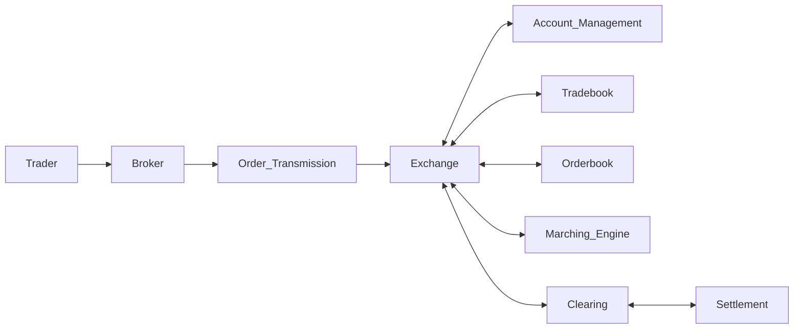
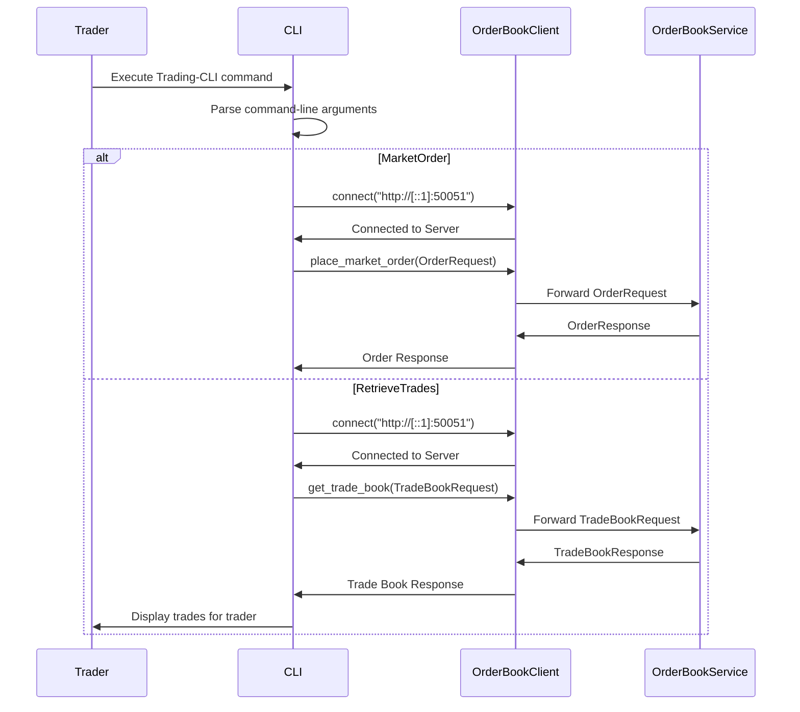
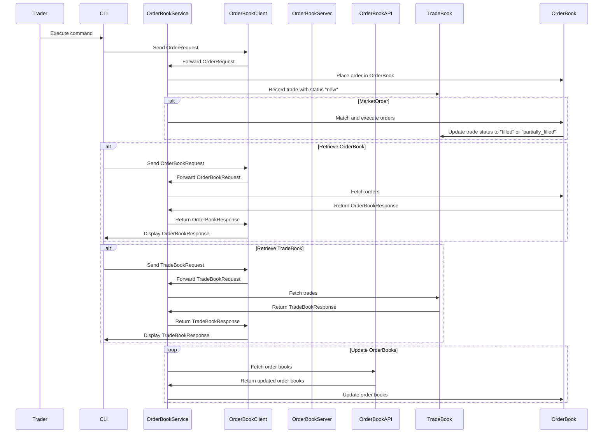

# Rust Exchange Sandpit in Rust with gRPC

[](https://github.com/janrockdev/rust-exchange/actions/workflows/rust.yml)

## Description
This simple Rust Exchange provides an example of implementation of a cryptocurrency orderbook with live connectivity to real crypto exchange. It has also option to run in --offline mode and use predefined orderbook to support testing and e.g., UI build. It supports real-time order matching for market and limit orders. Designed for performance and scalability, this project leverages Rust's memory safety and concurrency features to ensure high reliability and low latency. Key features include:

Final version will:
- Order Matching Engine: Handles various order types (limit, market) with high precision and speed from gRPC client CLI.
- Real-time Updates: Ensures immediate reflection of order book changes and market data.
- Concurrency: Utilizes Rust's async capabilities to process multiple transactions simultaneously.
- Ideal for developers looking to build high-performance trading systems and applications in the cryptocurrency space.

Current version:
- gRPC-based server
    - with periodic orderbook update from Kraken exchange using public API
    - orderbook data stored in in-memory cache with persistency to a disk
    - trade matching engine with logic to process market and limit order only (stop/cancel in progress)
- gRPC-based client
    - with sections for:
        - price updates
        - orderbook preview
        - trade execution
        - tradebook preview (in progress)
        - support to tradebook per trader (in progress)

## Extended version (private repo) with real-time dashboard


## TODO (backlog)
- [ ] review ordering for limit orders
- [ ] aggregation of orders by price for preview (remove id, ts)
- [ ] more tests
- [ ] profiling >> perf + flamegraph / tokio-console/TSan
- [ ] performance test >> criterion/wrk(http)
- [x] add all to Github Actions (CI/CD)

## Configuration

Configuration in config.yaml file (root folder / example):
```
kraken:
  symbols: ["XETHZUSD", "SUIUSD", "XXBTZUSD"] # pair to collect
  persist: "data" # path to persist orderbook + trade snapshots for testing purpose
  offline: ["data/offline/XXBTZUSD_order_book.csv", "data/offline/XETHZUSD_order_book.csv", "data/offline/SUIUSD_order_book.csv"] # path for offline testing orderbooks
```

## Tests
```shell
export RUST_LOG=debug
cargo test -- --nocapture
```

### Demo
```shell
# 1) run sever in offline mode
export RUST_LOG=debug
cargo run --bin server -- --offline

# output
Offline mode enabled: Loading order books from CSV files.
[2024-10-23T20:20:15Z INFO  server] Loaded order for XXBTZUSD: Price: 65303.20000, Volume: 0.001, Side: ask, ID: aebe5fde-5a35-4d82-8f54-18963ff07bc4, Timestamp: 2024-06-18T14:54:27.946288646+00:00
[2024-10-23T20:20:15Z INFO  server] Loaded order for XXBTZUSD: Price: 65296.70000, Volume: 0.375, Side: ask, ID: 4c578c60-753e-43a9-9a60-6cc8895e9704, Timestamp: 2024-06-18T14:54:27.946288646+00:00
[2024-10-23T20:20:15Z INFO  server] Loaded order for XXBTZUSD: Price: 65294.50000, Volume: 1.500, Side: ask, ID: 6f715879-5ac1-4201-912a-88c021a7b69b, Timestamp: 2024-06-18T14:54:27.946288646+00:00
[2024-10-23T20:20:15Z INFO  server] Loaded order for XXBTZUSD: Price: 65290.60000, Volume: 0.004, Side: ask, ID: 752ff333-d5b4-44ef-a008-6881ccd17f2c, Timestamp: 2024-06-18T14:54:27.946288646+00:00
[2024-10-23T20:20:15Z INFO  server] Loaded order for XXBTZUSD: Price: 65290.10000, Volume: 15.633, Side: ask, ID: ec7739a5-b43f-45ec-9aed-b314641bc7e9, Timestamp: 2024-06-18T14:54:27.946288646+00:00
[2024-10-23T20:20:15Z INFO  server] Loaded order for XXBTZUSD: Price: 65290.00000, Volume: 0.040, Side: bid, ID: f6dc7cfd-f985-4d3b-883b-ca8936f682c2, Timestamp: 2024-06-18T14:54:27.946288646+00:00
[2024-10-23T20:20:15Z INFO  server] Loaded order for XXBTZUSD: Price: 65279.40000, Volume: 0.082, Side: bid, ID: d67d153c-b0fc-405a-bd5e-113b53cb54ce, Timestamp: 2024-06-18T14:54:27.946288646+00:00
[2024-10-23T20:20:15Z INFO  server] Loaded order for XXBTZUSD: Price: 65279.30000, Volume: 0.001, Side: bid, ID: 925e5f92-dfda-47bd-94d2-33b824da8b17, Timestamp: 2024-06-18T14:54:27.946288646+00:00
[2024-10-23T20:20:15Z INFO  server] Loaded order for XXBTZUSD: Price: 65249.90000, Volume: 0.375, Side: bid, ID: 094c50c4-48eb-4e9a-ae30-1cff6849218e, Timestamp: 2024-06-18T14:54:27.946288646+00:00
[2024-10-23T20:20:15Z INFO  server] Loaded order for XXBTZUSD: Price: 65238.60000, Volume: 0.008, Side: bid, ID: 01c979ef-2a50-4ddd-b612-db7c75174ab4, Timestamp: 2024-06-18T14:54:27.946288646+00:00

# 2) run client with trade
cargo run --bin client market-order XXBTZUSD 1.4 buy market 0.0 Rock

# output
Processing order for trader: Rock
Orderbook status before processing trade: ----
Price: 65303.20000, Volume: 0.001, Side: ask, ID: aebe5fde-5a35-4d82-8f54-18963ff07bc4, Timestamp: 2024-06-18T14:54:27.946288646+00:00
Price: 65296.70000, Volume: 0.375, Side: ask, ID: 4c578c60-753e-43a9-9a60-6cc8895e9704, Timestamp: 2024-06-18T14:54:27.946288646+00:00
Price: 65294.50000, Volume: 1.500, Side: ask, ID: 6f715879-5ac1-4201-912a-88c021a7b69b, Timestamp: 2024-06-18T14:54:27.946288646+00:00
Price: 65290.60000, Volume: 0.004, Side: ask, ID: 752ff333-d5b4-44ef-a008-6881ccd17f2c, Timestamp: 2024-06-18T14:54:27.946288646+00:00
Price: 65290.10000, Volume: 15.633, Side: ask, ID: ec7739a5-b43f-45ec-9aed-b314641bc7e9, Timestamp: 2024-06-18T14:54:27.946288646+00:00
Price: 65290.00000, Volume: 0.040, Side: bid, ID: f6dc7cfd-f985-4d3b-883b-ca8936f682c2, Timestamp: 2024-06-18T14:54:27.946288646+00:00
Price: 65279.40000, Volume: 0.082, Side: bid, ID: d67d153c-b0fc-405a-bd5e-113b53cb54ce, Timestamp: 2024-06-18T14:54:27.946288646+00:00
Price: 65279.30000, Volume: 0.001, Side: bid, ID: 925e5f92-dfda-47bd-94d2-33b824da8b17, Timestamp: 2024-06-18T14:54:27.946288646+00:00
Price: 65249.90000, Volume: 0.375, Side: bid, ID: 094c50c4-48eb-4e9a-ae30-1cff6849218e, Timestamp: 2024-06-18T14:54:27.946288646+00:00
Price: 65238.60000, Volume: 0.008, Side: bid, ID: 01c979ef-2a50-4ddd-b612-db7c75174ab4, Timestamp: 2024-06-18T14:54:27.946288646+00:00
----------------------------------------------

Matched order: price: 65290.1, volume: 15.633, side: ask, timestamp: 2024-06-18T14:54:27.946288646+00:00, order_type: limit, id: ec7739a5-b43f-45ec-9aed-b314641bc7e9
Order partially matched, remaining volume updated: Order { id: ec7739a5-b43f-45ec-9aed-b314641bc7e9, price: OrderedFloat(65290.1), volume: OrderedFloat(14.232999999999999), side: "ask", timestamp: "2024-06-18T14:54:27.946288646+00:00", order_type: "limit" }

Orderbook status after processing trade: -----
Price: 65303.20000, Volume: 0.001, Side: ask, ID: aebe5fde-5a35-4d82-8f54-18963ff07bc4, Timestamp: 2024-06-18T14:54:27.946288646+00:00
Price: 65296.70000, Volume: 0.375, Side: ask, ID: 4c578c60-753e-43a9-9a60-6cc8895e9704, Timestamp: 2024-06-18T14:54:27.946288646+00:00
Price: 65294.50000, Volume: 1.500, Side: ask, ID: 6f715879-5ac1-4201-912a-88c021a7b69b, Timestamp: 2024-06-18T14:54:27.946288646+00:00
Price: 65290.60000, Volume: 0.004, Side: ask, ID: 752ff333-d5b4-44ef-a008-6881ccd17f2c, Timestamp: 2024-06-18T14:54:27.946288646+00:00
Price: 65290.10000, Volume: 14.233, Side: ask, ID: ec7739a5-b43f-45ec-9aed-b314641bc7e9, Timestamp: 2024-06-18T14:54:27.946288646+00:00
Price: 65290.00000, Volume: 0.040, Side: bid, ID: f6dc7cfd-f985-4d3b-883b-ca8936f682c2, Timestamp: 2024-06-18T14:54:27.946288646+00:00
Price: 65279.40000, Volume: 0.082, Side: bid, ID: d67d153c-b0fc-405a-bd5e-113b53cb54ce, Timestamp: 2024-06-18T14:54:27.946288646+00:00
Price: 65279.30000, Volume: 0.001, Side: bid, ID: 925e5f92-dfda-47bd-94d2-33b824da8b17, Timestamp: 2024-06-18T14:54:27.946288646+00:00
Price: 65249.90000, Volume: 0.375, Side: bid, ID: 094c50c4-48eb-4e9a-ae30-1cff6849218e, Timestamp: 2024-06-18T14:54:27.946288646+00:00
Price: 65238.60000, Volume: 0.008, Side: bid, ID: 01c979ef-2a50-4ddd-b612-db7c75174ab4, Timestamp: 2024-06-18T14:54:27.946288646+00:00
----------------------------------------------
```

## Build
```shell
cargo build --release
```

## Run (development)

### Server (development)

Run server in offline mode with orderbooks from snapshots for development:
```shell
# server
export RUST_LOG=debug
cargo run --bin server -- --offline
```

### Server (development)
```shell
# set the right level of logging
export RUST_LOG=info
cargo run --bin server
```

### Client (development)
```shell
# set the right level of logging
export RUST_LOG=info
cargo run --bin client market-order XXBTZUSD 1.4 buy market 0.0 Rock
cargo run --bin client market-order XXBTZUSD 1.4 sell market 0.0 Rock
cargo run --bin client market-order XXBTZUSD 1.4 buy limit 65248.0 Rock
cargo run --bin client market-order XXBTZUSD 1.4 sell limit 65248.0 Rock
```

```shell
# trader's trades
cargo run --bin client retrieve-trades Rock
# example
Trades for trader Rock:
ID: e006b2dd-1183-44f3-9231-62b6ea969c0f, Pair: XXBTZUSD, Side: buy, Price: 65290.09, Volume: 16, Timestamp: 2024-06-19T21:12:07.214014409+00:00, Id: e006b2dd-1183-44f3-9231-62b6ea969c0f, Status: new
ID: bc59817c-acb3-4b6d-a91c-5dae967bbcc7, Pair: XXBTZUSD, Side: ask, Price: 65290.1, Volume: 15.633, Timestamp: 2024-06-19T21:12:07.214395802+00:00, Id: bc59817c-acb3-4b6d-a91c-5dae967bbcc7, Status: filled
ID: c8e3d3da-5d4c-479b-84bb-b1ad5dd66c47, Pair: XXBTZUSD, Side: ask, Price: 65290.6, Volume: 0.004, Timestamp: 2024-06-19T21:12:07.214430880+00:00, Id: c8e3d3da-5d4c-479b-84bb-b1ad5dd66c47, Status: filled
ID: 4b80e237-5db6-4e96-b677-98b32574716b, Pair: XXBTZUSD, Side: ask, Price: 65294.5, Volume: 1.1369999999999991, Timestamp: 2024-06-19T21:12:07.214461156+00:00, Id: 4b80e237-5db6-4e96-b677-98b32574716b, Status: partially_filled

```

## Architeture decisions
- HashMap performance is O(1), while BTreeMap performance is O(log N), however we have just 2 keys and doing a lot insert/delete/lookup where HashMap should be better.
- Ordered_float crate in Rust that provides a way to handle f64 and f32 floating-point numbers with total ordering. The standard f64 and f32 types in Rust do not implement the Ord trait because floating-point numbers do not have a total order due to the presence of special values like NaN (Not a Number). OrderedFloat solves this problem by providing a total order for floating-point numbers.

## Notes

### Trade status
- New: The order has been received by the exchange but has not yet been processed or entered into the order book.
- Pending: The order is under review or awaiting certain conditions before it can be entered into the order book.
- Open: The order is active and has been entered into the order book. It is waiting to be matched with a counter order.
- Partially Filled: Part of the order has been matched and executed, but the entire order is not yet fully completed. The remaining portion remains open in the order book.
- Filled: The entire order has been matched and executed. There is no remaining quantity left in the order.
- Canceled: The order has been canceled by the trader or broker and will not be executed. This can happen before the order is fully or partially filled.
- Rejected: The order has been rejected by the exchange, possibly due to insufficient funds, incorrect order details, or violation of trading rules.
- Expired: The order has expired based on the time conditions set (e.g., good for day orders that are not filled by the end of the trading day).
- Pending Cancel: A cancellation request has been submitted for the order, but it has not yet been confirmed or processed.
- Pending Replace: A modification request has been submitted for the order (e.g., change in quantity or price), but it has not yet been confirmed or processed.

### Trade Status Flow
New -> Pending -> Open 
Open -> Partially Filled -> Filled
Open -> Canceled
Pending -> Rejected
Open -> Expired

### Generic Archicture



### Code Base:
#### Client:


#### Server:

